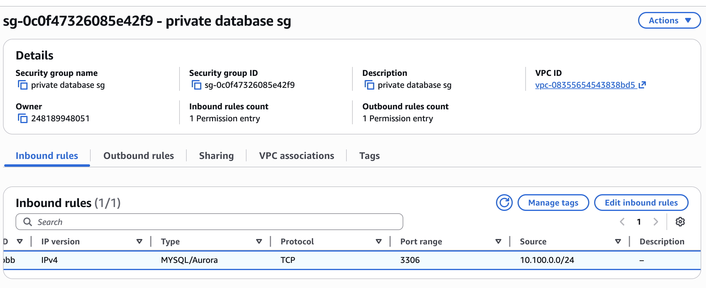
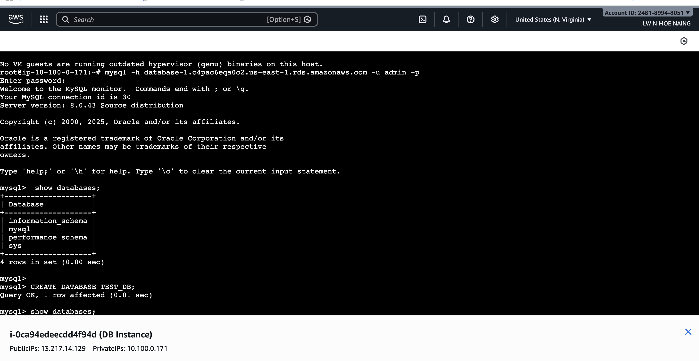
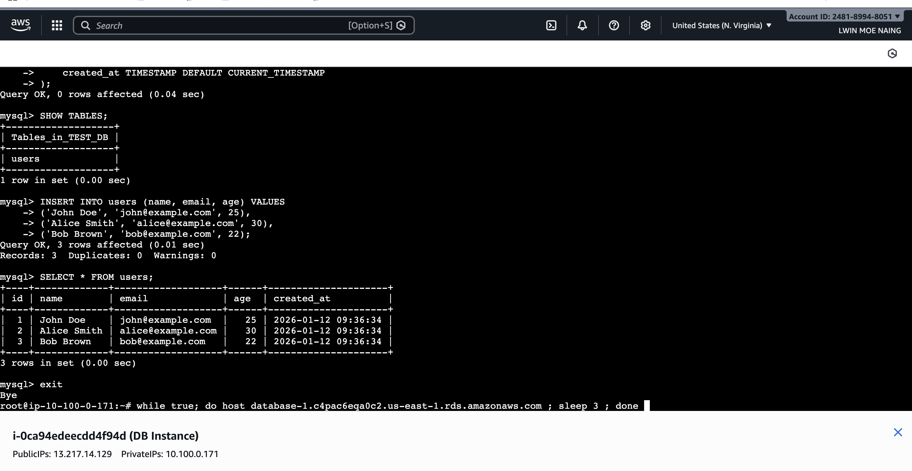
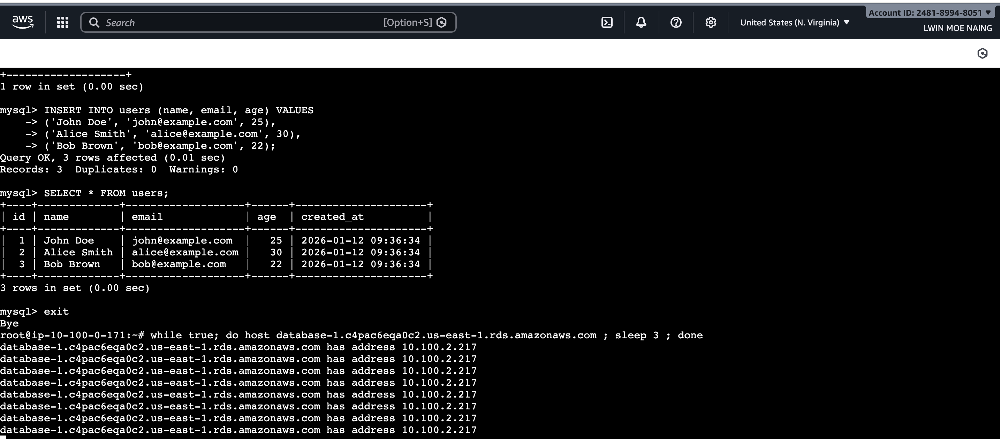
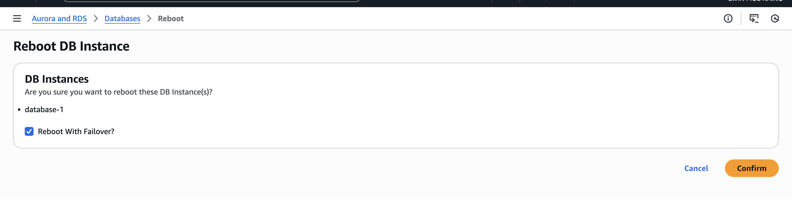
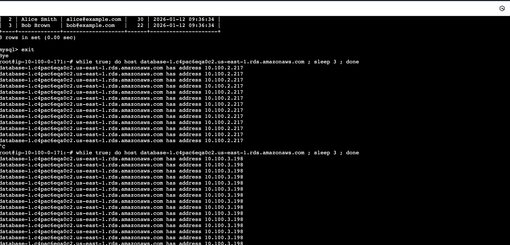
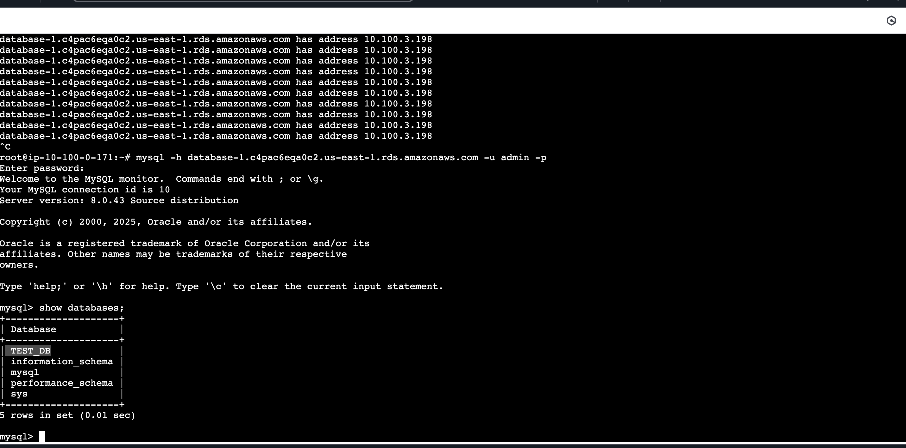
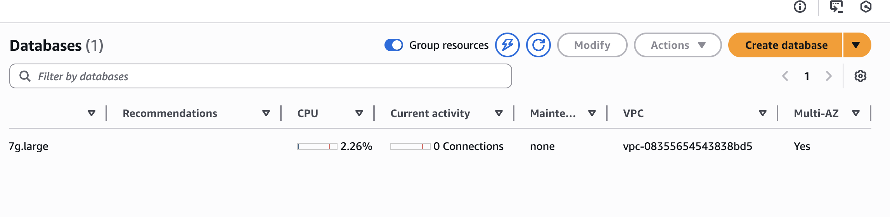

# AWS RDS Multi-AZ Deployment & Failover Lab

**AWS RDS Multi-AZ Deployment and Automatic Failover Testing Project with EC2 Bastion Host.**

**Scenario:** To ensure high availability and prevent data loss for business-critical applications, I implemented an AWS RDS Multi-AZ deployment. This project demonstrates the setup of a resilient database architecture and verifies the automatic failover process during a simulated disaster recovery scenario.
 
**シナリオ:** ビジネスに不可欠なアプリケーションのデータ損失を防ぎ、高可用性を確保するために、AWS RDSマルチAZデプロイメントを実装しました。このプロジェクトでは、復旧能力の高いデータベースアーキテクチャの構築と、災害復旧シナリオを想定した自動フェイルオーバープロセスの検証を行っています。

---

# **Project Architecture / プロジェクト構成図**

This setup utilizes a Public/Private Subnet architecture within a custom VPC to ensure maximum security for the database layer.
 
このセットアップでは、データベース層のセキュリティを最大限に確保するために、カスタムVPC内のパブリック/プライベートサブネットアーキテクチャを利用しています。

#  **Key Components / 主な構成要素**

* **VPC:** A secure, isolated network created with CIDR `10.100.0.0/16`.
* **Public Subnet:** Used for the Ubuntu EC2 Instance (Bastion Host) at `10.100.0.0/24`.
* **Private DB Subnets:** Three subnets distributed across Zones B, C, and D for Multi-AZ redundancy (`10.100.1.0/24`, `10.100.2.0/24`, `10.100.3.0/24`).
* **RDS Multi-AZ Deployment:** Synchronous replication between a Primary Instance and a Standby Instance in different AZs.

---

#  **Implementation Steps / 実装手順**

<b>Click here to view Step-by-Step Configuration & Results / ステップごとの設定と結果を表示するにはここをクリック</b>

| Step / ステップ | Description / 説明 | Screenshot / スクリーンショット |
|:---:|---|:---:|
| **1. Security Group** | Configured inbound rules for Port 3306 restricted to the Public Subnet. / パブリックサブネットからのポート3306のみを許可するようにインバウンドルールを構成しました。 | [ |
| **2. DB Connection & Creation** | Established connection to the RDS endpoint and successfully created the `TEST_DB` database. / RDSエンドポイントへの接続を確立し、`TEST_DB`データベースを正常に作成しました。 | [ |
| **3. Data Entry** | Created the `users` table and inserted sample data records. / `users`テーブルを作成し、サンプルデータレコードを挿入しました。 | [ |
| **4. Pre-Failover** | Verified the current active IP address (`10.100.2.217`) before triggering failover. / フェイルオーバーを実行する前に、現在アクティブなIPアドレス（`10.100.2.217`）を確認しました。 | [ |
| **5. Trigger Failover** | Executed "Reboot with Failover" via the AWS RDS Console. / AWS RDSコンソールから「フェイルオーバーを伴う再起動」を実行しました。 | [ |
| **6. Post-Failover** | Verified the new active IP address (`10.100.3.198`) after successful failover. / フェイルオーバー成功後、新しいアクティブIPアドレス（`10.100.3.198`）を確認しました。 | [|
| **7. Data Integrity** | Confirmed that `TEST_DB` and all records remained intact after the switch. / 切り替え後も`TEST_DB`とすべてのレコードがそのまま残っていることを確認しました。 | [ |
| **8. Multi-AZ Status** | Confirmed the "Multi-AZ: Yes" status on the RDS Dashboard to ensure infrastructure redundancy. / インフラストラクチャの冗長性を確保するために、RDSダッシュボードで「マルチAZ：はい」のステータスを確認しました。 | [ |

---

#  **Technical Insights / 技術解説**

* **High Availability (HA):** By using AWS RDS Multi-AZ, the service can recover in seconds from an AZ failure, ensuring minimal downtime for users.

* **マルチAZによる高可用性:** AWS RDSマルチAZを使用することで、AZ障害から数秒で復旧でき、ユーザーのダウンタイムを最小限に抑えることができます。

 

* **Zero Data Loss:** Synchronous replication guarantees that the standby instance is always up-to-date, preventing data loss during failover.

* **データ損失ゼロ:** 同期レプリケーションにより、スタンバイインスタンスが常に最新の状態に保たれ、フェイルオーバー時のデータ損失を防ぎます。

 

* **Security Best Practice:** Placing the database in a private subnet and using a Bastion Host protects the data from direct external attacks.

* **セキュリティのベストプラクティス:** データベースをプライベートサブネットに配置し、踏み台サーバーを使用することで、外部からの直接的な攻撃からデータを保護します。

---

#  **Tech Stack / 使用技術**

* **AWS Services:** RDS (MySQL), EC2 (Ubuntu 24.04), VPC, Security Groups, Route 53
* **Database Tools:** MySQL Client 8.0
* **Protocols:** TCP/IP, Port 3306
